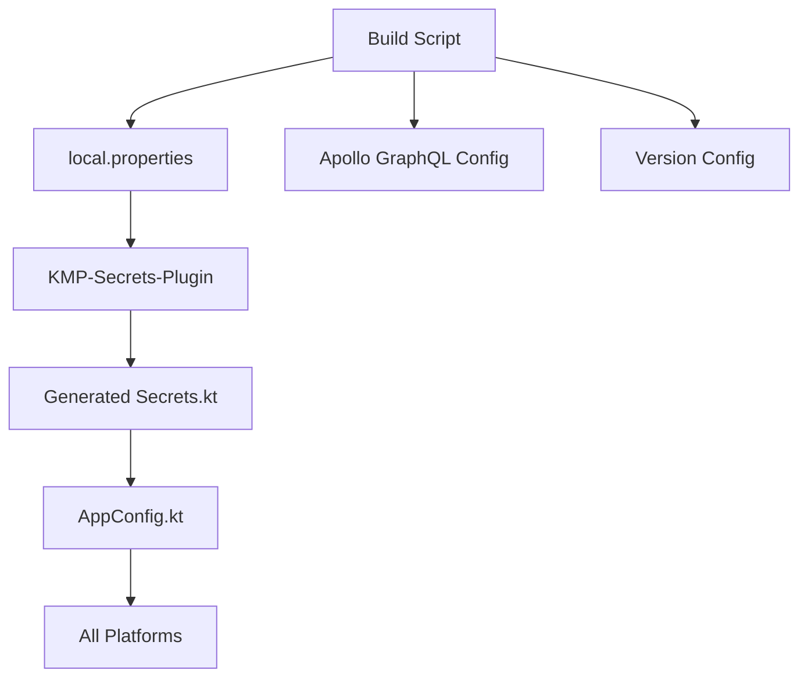

# Secrets and Versioning Management

This document explains how secrets and versioning are managed in the AryaMahasangh Kotlin Multiplatform project using
the **KMP-Secrets-Plugin** system.

## 🏗️ Architecture Overview

Our project uses a **single source of truth** approach where both secrets and versioning information are defined in
`local.properties` and automatically distributed across all platforms through code generation.

### Key Components

- **`local.properties`** - Single configuration file (gitignored)
- **KMP-Secrets-Plugin** - Generates type-safe `Secrets.kt` object
- **`AppConfig.kt`** - Environment-aware configuration wrapper
- **Build Integration** - Apollo GraphQL and version management
- **CI/CD Integration** - Environment variable override support

## 📝 Configuration Structure

### local.properties Format

```properties
# App Version (Semantic Versioning)
app_version=1.0.6

# Environment Selection
environment=dev

# Development Configuration
dev_supabase_url=https://your-dev-project.supabase.co
dev_supabase_key=eyJhbGciOiJIUzI1NiIsInR5cCI6IkpXVCJ9...
dev_server_url=http://localhost:4000
dev_googlemaps_apikey=your-dev-maps-key
dev_keystore_password=your-dev-keystore-pass
dev_key_alias=your-dev-key-alias
dev_key_password=your-dev-key-pass

# Production Configuration
prod_supabase_url=https://your-prod-project.supabase.co
prod_supabase_key=eyJhbGciOiJIUzI1NiIsInR5cCI6IkpXVCJ9...
prod_server_url=https://your-production-server.com
prod_googlemaps_apikey=your-prod-maps-key
prod_keystore_password=your-prod-keystore-pass
prod_key_alias=your-prod-key-alias
prod_key_password=your-prod-key-pass

# Additional Secrets
github_pat=ghp_your_github_token
```

**Important**: Use underscores (`_`) in property names for valid Kotlin identifiers.

## 🔄 How It Works

### 1. Code Generation Process



### 2. Generated Secrets Object

The plugin automatically generates:

```kotlin
// composeApp/src/commonMain/kotlin/secrets/Secrets.kt (Auto-generated)
object Secrets {
    const val app_version = "1.0.6"
    const val environment = "dev"
    const val dev_supabase_url = "https://your-dev.supabase.co"
    const val dev_supabase_key = "eyJhbGciOiJIUzI1NiIs..."
    const val prod_supabase_url = "https://your-prod.supabase.co"
    const val prod_supabase_key = "eyJhbGciOiJIUzI1NiIs..."
    // ... all properties from local.properties
}
```

### 3. AppConfig Wrapper

```kotlin
// Environment-aware configuration access
object AppConfig {
    val environment: String = Secrets.environment
    val versionName: String = Secrets.app_version
    val versionCode: Int = calculateVersionCode(Secrets.app_version)
    
    val supabaseUrl: String = when (environment) {
        "prod" -> Secrets.prod_supabase_url
        else -> Secrets.dev_supabase_url
    }
    
    val supabaseKey: String = when (environment) {
        "prod" -> Secrets.prod_supabase_key
        else -> Secrets.dev_supabase_key
    }
    
    // ... other environment-aware properties
}
```

## 🚀 Versioning System

### Single Source Versioning

- **Definition**: `app_version=1.0.6` in `local.properties`
- **Version Code**: Automatically calculated from semantic version
- **Distribution**: Same version used across all platforms

### Version Code Calculation

```kotlin
fun calculateVersionCode(version: String): Int {
    val parts = version.split(".")
    return when (parts.size) {
        3 -> parts[0].toInt() * 10000 + parts[1].toInt() * 100 + parts[2].toInt()
        2 -> parts[0].toInt() * 100 + parts[1].toInt()
        1 -> parts[0].toInt()
        else -> 1
    }
}

// Examples:
// "1.0.6" -> 10006
// "2.1.0" -> 20100
// "1.5" -> 105
```

### Platform-Specific Version Usage

**Android**:

```kotlin
// build.gradle.kts automatically sets:
versionCode = appVersionCode  // 10006
versionName = appVersion      // "1.0.6"
```

**Desktop**:

```kotlin
// JVM arguments passed automatically:
-Dapp.version.name=1.0.6
-Dapp.version.code=10006
```

**iOS/Web**:

```kotlin
// Runtime access via AppConfig:
val version = AppConfig.versionName  // "1.0.6"
val code = AppConfig.versionCode     // 10006
```

## 🔒 Secrets Management

### Environment-Based Configuration

The system supports multiple environments with automatic switching:

```properties
# Switch environment by changing this single property
environment=dev  # or "prod"
```

### Runtime Access Patterns

**Direct Access** (not recommended):

```kotlin
import secrets.Secrets

val url = Secrets.dev_supabase_url
val key = Secrets.prod_supabase_key
```

**Environment-Aware Access** (recommended):

```kotlin
import com.aryamahasangh.config.AppConfig

// Automatically selects dev_* or prod_* based on environment
val url = AppConfig.supabaseUrl
val key = AppConfig.supabaseKey
val mapsKey = AppConfig.googleMapsApiKey
```

### Security Features

- ✅ **Auto .gitignore**: Plugin prevents `Secrets.kt` from being committed
- ✅ **Compile-time constants**: No runtime loading overhead
- ✅ **Type safety**: Full IDE support with autocomplete
- ✅ **No initialization**: Secrets available immediately

## 🛠️ Build Integration

### Apollo GraphQL Introspection

The build script automatically configures Apollo based on the current environment:

```kotlin
// build.gradle.kts reads from local.properties
val supabaseUrl = localProps.getProperty("${environment}_supabase_url", "")
val supabaseKey = localProps.getProperty("${environment}_supabase_key", "")

apollo {
    service("service") {
        introspection {
            endpointUrl.set("$supabaseUrl/graphql/v1")
            headers.put("Authorization", "Bearer $supabaseKey")
            headers.put("apikey", supabaseKey)
        }
    }
}
```

### Android Build Configuration

```kotlin
android {
    defaultConfig {
        // Version from local.properties with CI override support
        versionCode = System.getenv("VERSION_CODE")?.toIntOrNull() ?: appVersionCode
        versionName = System.getenv("VERSION_NAME") ?: appVersion
        
        // Expose to BuildConfig
        buildConfigField("String", "VERSION_NAME", "\"${versionName}\"")
        buildConfigField("int", "VERSION_CODE", "$versionCode")
        buildConfigField("String", "ENVIRONMENT", "\"$environment\"")
    }
}
```

## 🔄 CI/CD Integration

### GitHub Actions Configuration

CI automatically creates `local.properties` for builds:

```yaml
- name: Create local.properties
  run: |
    echo "app_version=${{ needs.generate-version.outputs.version_name }}" >> local.properties
    echo "environment=dev" >> local.properties
    echo "dev_supabase_url=${{ secrets.SUPABASE_URL }}" >> local.properties
    echo "dev_supabase_key=${{ secrets.SUPABASE_KEY }}" >> local.properties
```

### Version Generation

CI uses commit-based versioning:

- **Pattern**: `1.0.${commit_count}`
- **Override**: Environment variables `VERSION_NAME` and `VERSION_CODE`
- **Consistency**: Same version across all platform builds

## 📱 Platform Support

### Cross-Platform Compatibility

| Platform | Version Access | Secrets Access | Build Integration |
|----------|---------------|----------------|-------------------|
| **Android** | BuildConfig + AppConfig | AppConfig | ✅ Gradle integration |
| **iOS** | AppConfig | AppConfig | ✅ Runtime access |
| **Desktop** | JVM args + AppConfig | AppConfig | ✅ JVM arguments |
| **Web/WASM** | AppConfig | AppConfig | ✅ Runtime access |

### Platform-Specific Features

- **Android**: Automatic version injection into APK
- **Desktop**: Version passed via JVM arguments
- **iOS**: Bundle configuration via AppConfig
- **Web**: No additional configuration needed

## 🚀 Developer Workflow

### Initial Setup

1. **Copy template**:
   ```bash
   cp local.properties.template local.properties
   # OR
   ./setup-dev.sh
   ```

2. **Configure secrets**:
   Edit `local.properties` with actual values

3. **Generate secrets**:
   ```bash
   ./gradlew compileKotlinMetadata
   ```

4. **Verify**:
   ```bash
   # Check that Secrets.kt was generated
   ls composeApp/src/commonMain/kotlin/secrets/
   ```

### Daily Development

- **Access secrets**: Use `AppConfig.propertyName`
- **Switch environments**: Change `environment=dev|prod` in `local.properties`
- **Update version**: Modify `app_version` in `local.properties`
- **Regenerate**: Run `./gradlew compileKotlinMetadata` after changes

### Release Process

1. **Update version**:
   ```properties
   app_version=1.0.7  # Increment in local.properties
   ```

2. **Switch to production**:
   ```properties
   environment=prod
   ```

3. **Build release**:
   ```bash
   ./gradlew assembleRelease  # Android
   ./gradlew createDistributable  # Desktop
   ```

## 🔍 Troubleshooting

### Common Issues

**Secrets.kt not generated**:

```bash
./gradlew clean compileKotlinMetadata
```

**Property not found**:

- Check property name uses underscores: `dev_supabase_url` ✅
- Verify no spaces around `=` in `local.properties`
- Ensure `local.properties` exists in project root

**Environment not switching**:

- Update `environment=dev|prod` in `local.properties`
- Rebuild to regenerate Secrets object
- Check AppConfig logic is correct

**Apollo introspection fails**:

- Verify `${environment}_supabase_url` and `${environment}_supabase_key` are set
- Check build output for configuration messages
- Ensure Supabase project allows GraphQL introspection

### Debug Information

```kotlin
// Get configuration summary
val info = AppConfig.getConfigInfo()
println(info)
// Output:
// Version: 1.0.6 (10006)
// Environment: dev
// Supabase URL: https://your-dev...
// Server URL: http://localhost:4000
// GraphQL URL: http://localhost:4000/graphql
```

## 📚 Benefits

### Over Previous Systems

| Aspect | Old System | KMP-Secrets-Plugin |
|--------|------------|-------------------|
| **Setup** | Complex scripts, multiple files | Single `local.properties` |
| **Type Safety** | String-based keys | Compile-time constants |
| **IDE Support** | No autocomplete | Full IntelliSense |
| **Security** | Manual gitignore | Auto-security |
| **Cross-Platform** | Expect/actual implementations | Single generated object |
| **Maintenance** | Multiple files to sync | Single source of truth |
| **Performance** | Runtime loading | Compile-time constants |

### Development Experience

- **🚀 Zero Setup**: No platform-specific initialization required
- **🔒 Secure by Default**: Auto-gitignore prevents accidental commits
- **⚡ Fast**: Compile-time constants, no runtime overhead
- **🛠️ IDE Friendly**: Full autocomplete and type checking
- **🎯 Consistent**: Same API across all platforms
- **📱 Adaptive**: Environment switching without code changes

This unified system ensures consistent, secure, and maintainable secrets and versioning management across the entire
Kotlin Multiplatform project.
