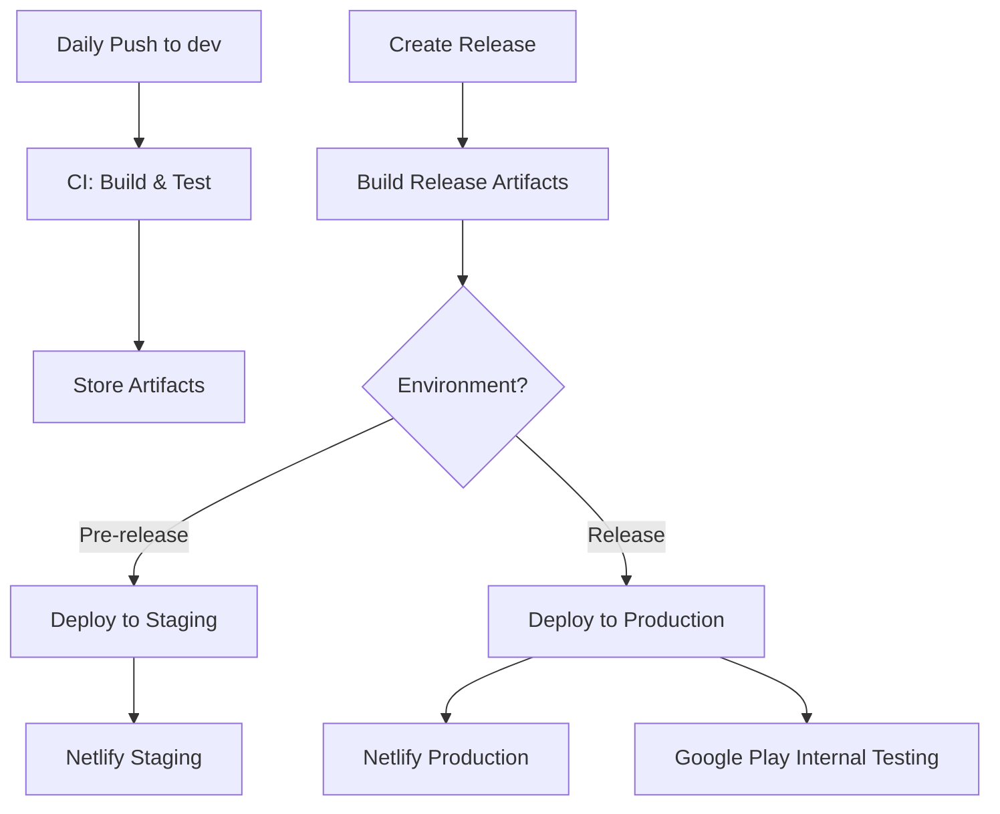

# 🚀 CI/CD Pipeline Setup Guide

This guide sets up a **production-ready CI/CD pipeline** for your Kotlin Multiplatform project with Google Play Store deployment.

## 🏗️ **Architecture Overview**



## ⚙️ **Quick Setup Checklist**

### **1. GitHub Secrets Configuration**

Navigate to your repository → Settings → Secrets and variables → Actions:

```bash
# Development Environment
SUPABASE_URL=your-dev-supabase-url
SUPABASE_KEY=your-dev-supabase-key
GOOGLE_MAPS_API_KEY=your-dev-maps-key

# Production Environment  
PROD_SUPABASE_URL=your-prod-supabase-url
PROD_SUPABASE_KEY=your-prod-supabase-key
PROD_GOOGLE_MAPS_API_KEY=your-prod-maps-key

# Android Signing
KEYSTORE_PASSWORD=your-keystore-password
KEY_PASSWORD=your-key-password

# Google Play Store
GOOGLE_PLAY_SERVICE_ACCOUNT=your-service-account-json

# Netlify Deployment
NETLIFY_AUTH_TOKEN=your-netlify-token
NETLIFY_SITE_ID=your-production-site-id
NETLIFY_STAGING_SITE_ID=your-staging-site-id

# Notifications
SLACK_WEBHOOK=your-slack-webhook-url
```

### **2. Environment Setup in GitHub**

Go to Settings → Environments and create:

- **staging** (no protection rules needed)
- **production** (add protection rules: "Required reviewers" with yourself)

### **3. Android Keystore Setup**

```bash
# Place your keystore file at: aryamahasangh.jks
# Update build.gradle.kts signing config to match secrets
```

## 🚀 **How to Use**

### **Daily Development**
```bash
git push origin dev
# ✅ Triggers CI build
# ✅ Generates artifacts
# ✅ Runs tests
# ❌ No deployment
```

### **Staging Release**
```bash
# Create a pre-release on GitHub
gh release create v1.0.0-beta --prerelease --notes "Beta release"
# ✅ Builds release artifacts
# ✅ Deploys to staging environment
# ✅ Netlify staging deployment
```

### **Production Release**
```bash
# Create a full release on GitHub
gh release create v1.0.0 --notes "Production release"
# ✅ Builds release artifacts  
# ⏳ Waits for manual approval (free plan)
# ✅ Deploys to production
# ✅ Google Play Internal Testing
# ✅ Netlify production deployment
```

## 📱 **Google Play Store Setup**

### **1. Create Service Account**
1. Go to [Google Play Console](https://play.google.com/console)
2. Setup → API access → Create service account
3. Download JSON key → Add to GitHub secrets as `GOOGLE_PLAY_SERVICE_ACCOUNT`

### **2. Internal Testing Track**
1. Release → Testing → Internal testing
2. Create internal testing release
3. Add testers (yourself initially)

### **3. First Manual Upload**
```bash
# Build release locally first time
./gradlew bundleRelease

# Upload manually to establish track
# Then automation takes over
```

## 🌐 **Netlify Setup**

### **1. Create Sites**
```bash
# Production site
netlify sites:create --name aryamahasangh-prod

# Staging site  
netlify sites:create --name aryamahasangh-staging
```

### **2. Get Site IDs**
```bash
netlify sites:list
# Copy site IDs to GitHub secrets
```

## 📊 **Monitoring & Health Checks**

### **Build Metrics Tracked**
- Build duration per platform
- Artifact sizes
- Test results
- Version progression

### **Deployment Verification**
- Post-deployment health checks
- Rollback procedures
- Performance monitoring

## 🔄 **Rollback Strategy**

### **Web Rollback**
```bash
# Via Netlify dashboard or CLI
netlify rollback --site=your-site-id
```

### **Android Rollback**
```bash
# Via Play Console
# Promote previous version or halt rollout
```

## 🚨 **Troubleshooting**

### **Common Issues**

**Build Failures:**
```bash
# Check secrets configuration
# Verify local.properties generation
# Review Gradle logs in Actions
```

**Deployment Failures:**
```bash
# Verify environment secrets
# Check artifact paths
# Review deployment logs
```

**Play Store Upload Issues:**
```bash
# Verify service account permissions
# Check bundle signing
# Ensure version code increment
```

## 📈 **Next Steps (Phase 2)**

### **Advanced Features to Add Later**
- [ ] Automatic version bumping
- [ ] Feature branch deployments  
- [ ] A/B testing integration
- [ ] Performance monitoring
- [ ] Security scanning
- [ ] iOS TestFlight automation

### **Metrics & Analytics**
- [ ] Build time optimization
- [ ] Success rate tracking
- [ ] DORA metrics implementation
- [ ] Release frequency analysis

## 🎯 **Senior Engineering Benefits**

### **Separation of Concerns**
- **CI**: Fast feedback, quality gates
- **CD**: Controlled, auditable deployments
- **Staging**: Safe testing ground
- **Production**: Reliable, rollback-ready

### **Risk Mitigation**
- Manual approval gates
- Artifact-based deployments
- Environment isolation
- Comprehensive rollback

### **Developer Experience**
- Clear feedback loops
- Self-service releases
- Comprehensive logging
- Slack notifications

---

**🚀 You're now ready for production deployments!**

Run a test by creating a pre-release to verify everything works before your first production release to Google Play Store.