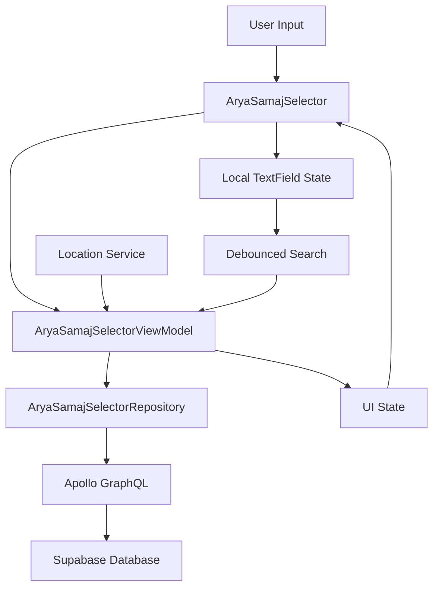

# AryaSamajSelector

A **self-contained, location-aware** component for AryaSamaj selection with infinite scroll, proximity-based sorting,
and real-time search. Built with Compose Multiplatform for Android, iOS, Web, and Desktop.

## 📋 **Overview**

AryaSamajSelector is a sophisticated selection system that handles AryaSamaj data loading, proximity-based sorting,
searching, and state management. It supports location-aware features, infinite scrolling, and provides an optimal user
experience across all platforms.

### **Key Features**

- ✅ **Self-contained**: No external data dependencies
- 📍 **Location-aware**: Proximity-based sorting with GPS integration
- ⚡ **Infinite scroll**: Pagination with automatic loading
- 🔍 **Real-time search**: Debounced search with intelligent filtering
- 📱 **Cross-platform**: Works on Android, iOS, Web, Desktop
- 🏗️ **Repository pattern**: Clean architecture with mockable interfaces
- 🎯 **Single selection**: Optimized for single AryaSamaj selection
- 🌍 **Adaptive UI**: Location-based and responsive design

---

## 🏗️ **Architecture**

### **Component Structure**

```
AryaSamajSelector/
├── FormComponents.kt                    # Main UI component (AryaSamajSelector)
├── AryaSamajSelectorViewModel.kt        # State management & business logic
├── AryaSamajSelectorRepository.kt       # Data interface
└── data/
    └── AryaSamajSelectorRepositoryImpl.kt   # Apollo GraphQL implementation
```

### **Data Flow**



### **Key Architectural Decisions**

#### **1. Location-Aware Design**

- **Feature**: Optional GPS-based proximity sorting
- **Implementation**: Haversine distance calculation for AryaSamaj locations
- **Benefits**: Users see nearest AryaSamajs first, improving relevance

#### **2. Self-Contained Architecture**

- **Problem**: External data dependencies caused stale data issues
- **Solution**: Component manages its own data through dedicated ViewModel and Repository
- **Benefits**: Always fresh data, consistent behavior across usage sites

#### **3. Single Selection Optimization**

- **Design**: Optimized for single AryaSamaj selection use cases
- **Implementation**: Radio button selection with immediate callback
- **Benefits**: Streamlined UX for organization/family forms

---

## 🚀 **Usage**

### **Basic Usage**

```kotlin
@Composable
fun MyScreen() {
  var selectedAryaSamaj by remember { mutableStateOf<AryaSamaj?>(null) }
  
  AryaSamajSelector(
    selectedAryaSamaj = selectedAryaSamaj,
    onAryaSamajSelected = { selectedAryaSamaj = it },
    label = "Select AryaSamaj"
  )
}
```

### **Location-Aware Usage**

```kotlin
@Composable
fun LocationAwareScreen() {
  var selectedAryaSamaj by remember { mutableStateOf<AryaSamaj?>(null) }
  val locationState by locationViewModel.locationState.collectAsState()
  
  AryaSamajSelector(
    selectedAryaSamaj = selectedAryaSamaj,
    onAryaSamajSelected = { selectedAryaSamaj = it },
    label = "Nearest AryaSamaj",
    latitude = locationState.latitude,
    longitude = locationState.longitude,
    modifier = Modifier.fillMaxWidth()
  )
}
```

### **Form Integration**

```kotlin
@Composable
fun CreateOrganisationForm() {
  var formData by remember { mutableStateOf(OrganisationFormData()) }
  
  Column {
    // Other form fields...
    
    AryaSamajSelector(
      selectedAryaSamaj = formData.aryaSamaj,
      onAryaSamajSelected = { aryaSamaj ->
        formData = formData.copy(aryaSamaj = aryaSamaj)
      },
      label = "आर्य समाज *",
      modifier = Modifier.width(400.dp)
    )
    
    // Error handling
    formData.aryaSamajError?.let { error ->
      Text(
        text = error,
        color = MaterialTheme.colorScheme.error,
        style = MaterialTheme.typography.bodySmall
      )
    }
  }
}
```

---

## ⚙️ **Configuration Options**

### **AryaSamajSelector Parameters**

| Parameter | Type | Default | Description |
|-----------|------|---------|-------------|
| `selectedAryaSamaj` | `AryaSamaj?` | null | Currently selected AryaSamaj |
| `onAryaSamajSelected` | `(AryaSamaj) -> Unit` | - | Selection callback |
| `label` | String | "आर्य समाज" | Component label |
| `placeholder` | String | "आर्य समाज चुनें" | Placeholder text |
| `latitude` | Double? | null | User's latitude for proximity sorting |
| `longitude` | Double? | null | User's longitude for proximity sorting |
| `modifier` | Modifier | `Modifier` | Compose modifier |
| `enabled` | Boolean | true | Whether component is interactive |

### **Selection Dialog Parameters**

| Parameter | Type | Default | Description |
|-----------|------|---------|-------------|
| `onDismiss` | `() -> Unit` | - | Dialog dismiss callback |
| `onAryaSamajSelected` | `(AryaSamaj) -> Unit` | - | Selection callback |
| `selectedAryaSamaj` | `AryaSamaj?` | null | Pre-selected AryaSamaj to highlight |
| `latitude` | Double? | null | GPS latitude for sorting |
| `longitude` | Double? | null | GPS longitude for sorting |

---

## 🔧 **Technical Implementation**

### **GraphQL Queries**

The component uses optimized GraphQL queries with cursor-based pagination and location support:

```graphql
# Recent AryaSamajs with optional location sorting
query RecentAryaSamajsQuery($first: Int!, $after: Cursor, $lat: Float, $lng: Float) {
  aryaSamajCollection(
    first: $first,
    after: $after,
    orderBy: { createdAt: DescNullsLast }
  ) {
    edges {
      node {
        aryaSamajFields {
          id
          name
        }
        address {
          ...AddressFields
        }
      }
      cursor
    }
    pageInfo {
      hasNextPage
      endCursor
    }
  }
}

# Search AryaSamajs by name with pagination
query SearchAryaSamajsQuery($searchTerm: String!, $first: Int!, $after: Cursor) {
  aryaSamajCollection(
    first: $first,
    after: $after,
    filter: {
      name: { ilike: $searchTerm }
    },
    orderBy: { createdAt: DescNullsLast }
  ) {
    edges {
      node {
        aryaSamajWithAddress {
          aryaSamajFields {
            id
            name
          }
          address {
            ...AddressFields
          }
        }
      }
      cursor
    }
    pageInfo {
      hasNextPage
      endCursor
    }
  }
}
```

### **Repository Implementation**

```kotlin
class AryaSamajSelectorRepositoryImpl(
  private val apolloClient: ApolloClient
) : AryaSamajSelectorRepository {

  override suspend fun getRecentAryaSamajs(
    limit: Int,
    cursor: String?,
    latitude: Double?,
    longitude: Double?
  ): Flow<Result<AryaSamajPaginatedResult<AryaSamaj>>> = flow {
    emit(Result.Loading)
    
    apolloClient.query(
      RecentAryaSamajsQuery(
        first = limit,
        after = if (cursor != null) Optional.Present(cursor) else Optional.Absent,
        lat = Optional.presentIfNotNull(latitude),
        lng = Optional.presentIfNotNull(longitude)
      )
    ).fetchPolicy(FetchPolicy.CacheAndNetwork)
      .toFlow()
      .collect { response ->
        val result = safeCall {
          val aryaSamajs = processAryaSamajResponse(response, latitude, longitude)
          AryaSamajPaginatedResult(
            items = aryaSamajs,
            hasNextPage = response.data?.aryaSamajCollection?.pageInfo?.hasNextPage ?: false,
            endCursor = response.data?.aryaSamajCollection?.pageInfo?.endCursor
          )
        }
        emit(result)
      }
  }
}
```

### **Location-Based Sorting**

```kotlin
private fun calculateDistance(
  lat1: Double, lon1: Double,
  lat2: Double, lon2: Double
): Double {
  val earthRadius = 6371.0 // kilometers
  
  val dLat = Math.toRadians(lat2 - lat1)
  val dLon = Math.toRadians(lon2 - lon1)
  
  val a = sin(dLat / 2).pow(2) +
    cos(Math.toRadians(lat1)) * cos(Math.toRadians(lat2)) *
    sin(dLon / 2).pow(2)
    
  val c = 2 * atan2(sqrt(a), sqrt(1 - a))
  return earthRadius * c
}

private fun sortByProximity(
  aryaSamajs: List<Pair<AryaSamaj, Double>>,
  userLat: Double,
  userLng: Double
): List<AryaSamaj> {
  return aryaSamajs
    .sortedBy { (_, distance) -> distance }
    .map { (aryaSamaj, _) -> aryaSamaj }
}
```

### **ViewModel State Management**

```kotlin
data class AryaSamajSelectorUiState(
  val recentAryaSamajs: List<AryaSamaj> = emptyList(),
  val searchResults: List<AryaSamaj> = emptyList(),
  val isLoadingRecent: Boolean = false,
  val isSearching: Boolean = false,
  val isLoadingMore: Boolean = false,
  val hasNextPageRecent: Boolean = true,
  val hasNextPageSearch: Boolean = true,
  val currentSearchQuery: String = "",
  val error: String? = null,
  val showRetryButton: Boolean = false,
  val retryCount: Int = 0
)

class AryaSamajSelectorViewModel(
  private val repository: AryaSamajSelectorRepository
) : ViewModel() {
  
  fun loadRecentAryaSamajs(
    latitude: Double? = null,
    longitude: Double? = null,
    resetPagination: Boolean = true
  ) {
    // Implementation with location-aware loading
  }
  
  fun triggerSearch(query: String) {
    _searchTrigger.value = query
  }
  
  fun loadNextPage() {
    // Infinite scroll implementation
  }
}
```

---

## 🌍 **Location Features**

### **GPS Integration**

```kotlin
// Location-aware sorting
@Composable
fun LocationAwareAryaSamajSelector() {
  val locationState by locationViewModel.currentLocation.collectAsState()
  
  AryaSamajSelector(
    selectedAryaSamaj = selectedAryaSamaj,
    onAryaSamajSelected = { selectedAryaSamaj = it },
    latitude = locationState?.latitude,
    longitude = locationState?.longitude,
    label = "निकटतम आर्य समाज"
  )
}
```

### **Distance Calculation**

The component uses the **Haversine formula** for accurate distance calculation:

```kotlin
private fun haversineDistance(
  lat1: Double, lng1: Double,
  lat2: Double, lng2: Double
): Double {
  val R = 6371.0 // Earth's radius in kilometers
  
  val dLat = Math.toRadians(lat2 - lat1)
  val dLng = Math.toRadians(lng2 - lng1)
  
  val a = sin(dLat / 2).pow(2) +
          cos(Math.toRadians(lat1)) * cos(Math.toRadians(lat2)) *
          sin(dLng / 2).pow(2)
          
  val c = 2 * atan2(sqrt(a), sqrt(1 - a))
  return R * c
}
```

### **Location Permissions**

```kotlin
// Handle location permissions
@Composable
fun RequestLocationPermission() {
  val permissionState = rememberPermissionState(
    android.Manifest.permission.ACCESS_FINE_LOCATION
  )
  
  LaunchedEffect(Unit) {
    if (!permissionState.hasPermission) {
      permissionState.launchPermissionRequest()
    }
  }
}
```

---

## 🔄 **State Management**

### **Selection State**

```kotlin
// Single AryaSamaj selection
var selectedAryaSamaj by remember { mutableStateOf<AryaSamaj?>(null) }

// Form integration
data class FormState(
  val selectedAryaSamaj: AryaSamaj? = null,
  val aryaSamajError: String? = null
) {
  fun validateAryaSamaj(): String? {
    return if (selectedAryaSamaj == null) {
      "आर्य समाज चुनना आवश्यक है"
    } else null
  }
}
```

### **Location State**

```kotlin
data class LocationState(
  val latitude: Double? = null,
  val longitude: Double? = null,
  val accuracy: Float? = null,
  val isLoading: Boolean = false,
  val error: String? = null
)
```

### **Search State Transitions**

1. **Initial**: Recent AryaSamajs loaded (with/without location)
2. **Searching**: Real-time search results
3. **Loading More**: Pagination in progress
4. **Error**: Error handling with retry options
5. **Empty**: No results found state

---

## 🎨 **UI/UX Considerations**

### **Responsive Design**

- **Mobile**: Full-width selector, touch-optimized dialog
- **Tablet**: Adaptive width (400dp max), larger targets
- **Desktop**: Precise clicking, keyboard navigation
- **Web**: Progressive enhancement

### **Location UX**

```kotlin
@Composable
fun LocationAwareLabel(
  hasLocation: Boolean,
  isLoading: Boolean
) {
  val label = when {
    isLoading -> "स्थान प्राप्त कर रहे हैं..."
    hasLocation -> "निकटतम आर्य समाज"
    else -> "आर्य समाज"
  }
  
  Row(verticalAlignment = Alignment.CenterVertically) {
    Text(label)
    if (hasLocation) {
      Icon(
        Icons.Default.LocationOn,
        contentDescription = "Location enabled",
        modifier = Modifier.size(16.dp),
        tint = MaterialTheme.colorScheme.primary
      )
    }
  }
}
```

### **Search Experience**

- **Minimum 2 characters**: "न्यूनतम २ अक्षर आवश्यक"
- **No results**: "कोई आर्य समाज नहीं मिला"
- **Loading states**: Clear visual feedback
- **Error recovery**: Retry mechanisms

### **Accessibility**

- Screen reader support for Hindi text
- Location status announcements
- Keyboard navigation
- High contrast support

---

## ⚡ **Performance Optimizations**

### **Current Optimizations**

1. **Pagination**: 20 items per page
2. **Debouncing**: 300ms search delay
3. **Location caching**: Cache distance calculations
4. **Apollo cache**: FetchPolicy.CacheAndNetwork

### **Location Performance**

```kotlin
// Cache distance calculations
class DistanceCache {
  private val cache = mutableMapOf<Pair<String, String>, Double>()
  
  fun getDistance(
    aryaSamajId: String,
    userLocation: String,
    calculator: () -> Double
  ): Double {
    val key = aryaSamajId to userLocation
    return cache.getOrPut(key, calculator)
  }
}
```

### **Memory Management**

- Proper coroutine cancellation
- Location listener cleanup
- Image loading optimization
- Cache size limits

---

## 🔧 **Customization & Extension**

### **Custom Location Providers**

```kotlin
interface LocationProvider {
  suspend fun getCurrentLocation(): LocationResult
  fun isLocationEnabled(): Boolean
}

class GPSLocationProvider : LocationProvider {
  override suspend fun getCurrentLocation(): LocationResult {
    // Platform-specific GPS implementation
  }
}

class NetworkLocationProvider : LocationProvider {
  override suspend fun getCurrentLocation(): LocationResult {
    // Network-based location (IP geolocation)
  }
}
```

### **Custom Distance Calculations**

```kotlin
interface DistanceCalculator {
  fun calculateDistance(
    from: LatLng,
    to: LatLng
  ): Distance
}

class HaversineCalculator : DistanceCalculator {
  override fun calculateDistance(from: LatLng, to: LatLng): Distance {
    // Haversine formula implementation
  }
}

class ManhattanCalculator : DistanceCalculator {
  override fun calculateDistance(from: LatLng, to: LatLng): Distance {
    // Manhattan distance for city grids
  }
}
```

### **Custom UI Themes**

```kotlin
@Composable
fun CustomAryaSamajSelector() {
  MaterialTheme(
    colorScheme = darkColorScheme(
      primary = Color(0xFF1976D2),
      surface = Color(0xFF121212)
    )
  ) {
    AryaSamajSelector(...)
  }
}
```

---

## 🧪 **Testing Strategy**

### **Unit Tests**

```kotlin
@Test
fun `should sort AryaSamajs by proximity when location provided`() = runTest {
  val mockRepository = mockk<AryaSamajSelectorRepository>()
  val aryaSamajs = listOf(
    mockAryaSamaj(id = "1", lat = 28.6139, lng = 77.2090), // Delhi
    mockAryaSamaj(id = "2", lat = 19.0760, lng = 72.8777)  // Mumbai
  )
  
  every { mockRepository.getRecentAryaSamajs(any(), any(), 28.0, 77.0) } returns
    flowOf(Result.Success(mockPaginatedResult(sortedByDistance(aryaSamajs))))
    
  val viewModel = AryaSamajSelectorViewModel(mockRepository)
  viewModel.loadRecentAryaSamajs(latitude = 28.0, longitude = 77.0)
  
  viewModel.uiState.test {
    val state = awaitItem()
    assertEquals("1", state.recentAryaSamajs.first().id) // Delhi should be first
  }
}
```

### **Location Tests**

```kotlin
@Test
fun `should handle location permission denied gracefully`() = runTest {
  val mockLocationProvider = mockk<LocationProvider>()
  every { mockLocationProvider.getCurrentLocation() } throws LocationPermissionException()
  
  val viewModel = AryaSamajSelectorViewModel(mockRepository, mockLocationProvider)
  
  // Should fall back to non-location mode
  viewModel.uiState.test {
    val state = awaitItem()
    assertFalse(state.isLocationEnabled)
    assertTrue(state.recentAryaSamajs.isNotEmpty()) // Still shows results
  }
}
```

### **Integration Tests**

```kotlin
@Test
fun `should perform location-aware AryaSamaj selection`() {
  composeTestRule.setContent {
    AryaSamajSelector(
      latitude = 28.6139,
      longitude = 77.2090,
      ...
    )
  }
  
  composeTestRule
    .onNodeWithText("आर्य समाज चुनें")
    .performClick()
    
  // Should show nearest AryaSamaj first
  composeTestRule
    .onNodeWithText("Delhi AryaSamaj")
    .assertIsDisplayed()
    .performClick()
    
  // Verify selection
  assert(selectedAryaSamaj?.name == "Delhi AryaSamaj")
}
```

---

## 🔮 **Future Improvements**

### **Enhanced Location Features**

#### **1. Geofencing**

```kotlin
data class Geofence(
  val center: LatLng,
  val radiusMeters: Double,
  val aryaSamajId: String
)

interface GeofenceManager {
  suspend fun addGeofence(geofence: Geofence)
  fun onEnterGeofence(callback: (AryaSamaj) -> Unit)
  fun onExitGeofence(callback: (AryaSamaj) -> Unit)
}
```

#### **2. Route Optimization**

```kotlin
// Integration with mapping services
interface RouteCalculator {
  suspend fun calculateRoute(
    from: LatLng,
    to: LatLng,
    transportMode: TransportMode = TransportMode.DRIVING
  ): RouteResult
}

enum class TransportMode {
  DRIVING, WALKING, PUBLIC_TRANSPORT, CYCLING
}
```

#### **3. Real-time Distance Updates**

```kotlin
// Live location tracking
@Composable
fun RealTimeDistanceTracker() {
  val locationUpdates = locationViewModel.locationUpdates.collectAsState()
  
  LaunchedEffect(locationUpdates.value) {
    // Update distances as user moves
    viewModel.updateUserLocation(locationUpdates.value)
  }
}
```

### **Advanced Search Features**

#### **1. Multi-criteria Search**

```kotlin
data class AryaSamajSearchFilters(
  val name: String? = null,
  val district: String? = null,
  val state: String? = null,
  val radiusKm: Double? = null,
  val establishedAfter: LocalDate? = null,
  val hasEvents: Boolean? = null
)
```

#### **2. Search History & Suggestions**

```kotlin
interface SearchHistoryManager {
  suspend fun saveSearch(query: String)
  suspend fun getSearchHistory(): List<String>
  suspend fun getSearchSuggestions(query: String): List<String>
  suspend fun clearHistory()
}
```

#### **3. Fuzzy Search**

```kotlin
// Handle typos and partial matches
class FuzzySearchEngine {
  fun search(
    query: String,
    items: List<AryaSamaj>,
    threshold: Double = 0.7
  ): List<Pair<AryaSamaj, Double>> {
    return items.mapNotNull { aryaSamaj ->
      val similarity = calculateSimilarity(query, aryaSamaj.name)
      if (similarity >= threshold) {
        aryaSamaj to similarity
      } else null
    }.sortedByDescending { it.second }
  }
}
```

### **Virtual Scrolling Implementation**

For extremely large datasets (>10,000 AryaSamajs):

```kotlin
@Composable
fun VirtualizedAryaSamajList(
  items: List<AryaSamaj>,
  onItemSelected: (AryaSamaj) -> Unit
) {
  val listState = rememberLazyListState()
  val visibleItemsCount = 10 // Items visible on screen
  
  LazyColumn(state = listState) {
    items(items.size) { index ->
      val isVisible = index in (listState.firstVisibleItemIndex until 
        listState.firstVisibleItemIndex + visibleItemsCount + 5)
        
      if (isVisible) {
        AryaSamajItem(
          aryaSamaj = items[index],
          onClick = { onItemSelected(items[index]) }
        )
      } else {
        // Placeholder to maintain scroll position
        Spacer(modifier = Modifier.height(72.dp))
      }
    }
  }
}
```

**Trade-offs for Virtual Scrolling**:

- ✅ Handles massive datasets efficiently
- ✅ Constant memory usage
- ❌ Complex implementation
- ❌ Limited by Compose Multiplatform support
- ❌ Harder to implement location-based sorting

---

## 🚨 **Common Issues & Solutions**

### **Issue: Location Not Working**

**Causes**:

- Missing permissions
- GPS disabled
- Network location unavailable

**Solutions**:

```kotlin
// Comprehensive location handling
@Composable
fun LocationAwareSelector() {
  val locationState by locationViewModel.locationState.collectAsState()
  
  when (locationState) {
    is LocationState.PermissionDenied -> {
      // Show permission request
      RequestLocationPermission()
    }
    is LocationState.Disabled -> {
      // Show enable GPS prompt
      EnableGPSPrompt()
    }
    is LocationState.Loading -> {
      // Show loading with fallback
      AryaSamajSelector(showLocationLoading = true)
    }
    is LocationState.Success -> {
      // Full location features
      AryaSamajSelector(
        latitude = locationState.latitude,
        longitude = locationState.longitude
      )
    }
  }
}
```

### **Issue: Slow Search Performance**

**Cause**: No search optimization or large datasets
**Solution**: Implement search optimizations

```kotlin
// Optimized search with caching
class OptimizedSearchManager {
  private val searchCache = LRUCache<String, List<AryaSamaj>>(maxSize = 100)
  
  suspend fun search(query: String): List<AryaSamaj> {
    // Check cache first
    searchCache[query]?.let { return it }
    
    // Perform search with debouncing
    delay(300)
    val results = repository.searchAryaSamajs(query)
    
    // Cache results
    searchCache[query] = results
    return results
  }
}
```

### **Issue: Inaccurate Distance Calculations**

**Cause**: Using simple Euclidean distance instead of Haversine
**Solution**: Use proper geodesic calculations

```kotlin
// ❌ Incorrect - Euclidean distance
fun badDistance(lat1: Double, lng1: Double, lat2: Double, lng2: Double): Double {
  return sqrt((lat2 - lat1).pow(2) + (lng2 - lng1).pow(2))
}

// ✅ Correct - Haversine formula
fun goodDistance(lat1: Double, lng1: Double, lat2: Double, lng2: Double): Double {
  val R = 6371.0 // Earth's radius in kilometers
  val dLat = Math.toRadians(lat2 - lat1)
  val dLng = Math.toRadians(lng2 - lng1)
  
  val a = sin(dLat / 2).pow(2) +
          cos(Math.toRadians(lat1)) * cos(Math.toRadians(lat2)) *
          sin(dLng / 2).pow(2)
          
  val c = 2 * atan2(sqrt(a), sqrt(1 - a))
  return R * c
}
```

---

## 📚 **Related Documentation**

- [MembersComponent](./MembersComponent.md) - Similar selector component patterns
- [Location Services](../location/LocationServices.md) - GPS and location handling
- [Repository Pattern](../architecture/RepositoryPattern.md) - Data layer architecture
- [Apollo GraphQL Setup](../graphql/ApolloSetup.md) - GraphQL configuration
- [Compose Testing](../testing/ComposeTesting.md) - Testing strategies

---

## 🤝 **Contributing**

### **Development Guidelines**

1. Follow existing architectural patterns from MembersComponent
2. Write comprehensive tests including location scenarios
3. Update documentation for any API changes
4. Consider cross-platform location differences
5. Ensure accessibility compliance

### **Code Review Checklist**

- [ ] Repository interface properly abstracted
- [ ] ViewModel handles location states correctly
- [ ] UI supports all platforms and screen sizes
- [ ] Location permissions handled gracefully
- [ ] Distance calculations are accurate
- [ ] Performance impact assessed
- [ ] Accessibility tested
- [ ] Documentation updated

### **Location Testing Guidelines**

- Test with various location scenarios (GPS on/off, permissions, accuracy)
- Verify distance calculations with known coordinates
- Test graceful degradation when location unavailable
- Ensure cross-platform location behavior

---

**Last Updated**: January 19, 2025  
**Version**: 2.0.0  
**Maintainer**: Development Team
