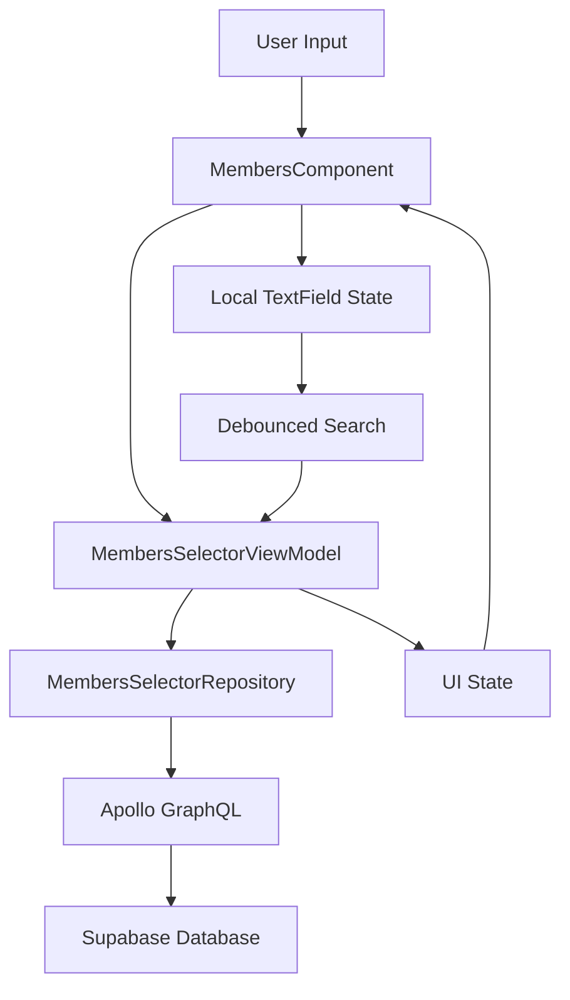

# MembersComponent

A **self-contained, production-ready** component for member selection with infinite scroll, real-time search, and
flexible configuration options. Built with Compose Multiplatform for Android, iOS, Web, and Desktop.

## 📋 **Overview**

MembersComponent is a comprehensive member selection system that handles its own data loading, searching, and state
management. It supports both single and multiple selection modes, family member management, infinite scrolling, and
works with different member collections.

### **Key Features**

- ✅ **Self-contained**: No external data dependencies
- ⚡ **Infinite scroll**: Pagination with automatic loading
- 🔍 **Real-time search**: Debounced search with 2-character minimum
- 🎯 **Multiple modes**: Single, multiple, and family member selection
- 📱 **Cross-platform**: Works on Android, iOS, Web, Desktop
- 🏗️ **Repository pattern**: Clean architecture with mockable interfaces
- 🔄 **Collection switching**: Regular members vs members not in family
- 🎨 **Adaptive UI**: Mobile, tablet, and desktop optimized

---

## 🏗️ **Architecture**

### **Component Structure**

```
MembersComponent/
├── MembersComponent.kt              # Main UI component
├── MembersSelectorViewModel.kt      # State management & business logic  
├── MembersSelectorRepository.kt     # Data interface
└── data/
    └── MembersSelectorRepositoryImpl.kt  # Apollo GraphQL implementation
```

### **Data Flow**



### **Key Architectural Decisions**

#### **1. Self-Contained Design**

- **Problem**: External data parameters became stale, causing "newly created members don't appear" bugs
- **Solution**: Component manages its own data through dedicated ViewModel and Repository
- **Benefits**: Always fresh data, no dependency injection complexity at usage sites

#### **2. Dual State Management**

- **Local TextField State**: Handles immediate typing without lag
- **ViewModel State**: Manages business logic and search results
- **Benefits**: Eliminates cursor jumping, smooth typing experience

#### **3. Collection Type Support**

```kotlin
enum class MemberCollectionType {
  ALL_MEMBERS,                    // Regular member collection
  MEMBERS_NOT_IN_FAMILY          // Members without family assignments
}
```

---

## 🚀 **Usage**

### **Basic Usage**

```kotlin
@Composable
fun MyScreen() {
  var membersState by remember { mutableStateOf(MembersState()) }
  
  MembersComponent(
    state = membersState,
    onStateChange = { membersState = it },
    config = MembersConfig(
      label = "Select Members",
      choiceType = MembersChoiceType.MULTIPLE
    )
  )
}
```

### **Advanced Configuration**

```kotlin
MembersComponent(
  state = membersState,
  onStateChange = { membersState = it },
  config = MembersConfig(
    label = "परिवार के सदस्य *",
    addButtonText = "सदस्य जोड़ें",
    choiceType = MembersChoiceType.MULTIPLE,
    editMode = MembersEditMode.FAMILY_MEMBERS,
    memberCollectionType = MemberCollectionType.MEMBERS_NOT_IN_FAMILY,
    isMandatory = true,
    minMembers = 1,
    showMemberCount = true,
    enableReordering = true,
    
    // Family-specific callbacks
    onFamilyHeadChanged = { memberId, isHead ->
      viewModel.updateMemberHead(memberId, isHead)
    },
    onFamilyRelationChanged = { memberId, relation ->
      viewModel.updateMemberRelation(memberId, relation)
    },
    getFamilyHead = { memberId ->
      familyMembers.find { it.member.id == memberId }?.isHead ?: false
    },
    getFamilyRelation = { memberId ->
      familyMembers.find { it.member.id == memberId }?.relationToHead
    }
  ),
  error = membersError
)
```

---

## ⚙️ **Configuration Options**

### **MembersConfig Parameters**

| Parameter | Type | Default | Description |
|-----------|------|---------|-------------|
| `label` | String | "सदस्य" | Component label |
| `addButtonText` | String | "सदस्य जोड़ें" | Add button text |
| `choiceType` | `MembersChoiceType` | `MULTIPLE` | Single or multiple selection |
| `editMode` | `MembersEditMode` | `INDIVIDUAL` | How members are displayed/edited |
| `memberCollectionType` | `MemberCollectionType` | `ALL_MEMBERS` | Which collection to query |
| `isMandatory` | Boolean | false | Whether selection is required |
| `minMembers` | Int | 0 | Minimum required members |
| `maxMembers` | Int? | null | Maximum allowed members |
| `showMemberCount` | Boolean | false | Show member count in header |
| `enableReordering` | Boolean | false | Allow drag-and-drop reordering |
| `reorderingHint` | String? | null | Hint text for reordering |

### **Choice Types**

```kotlin
enum class MembersChoiceType {
  SINGLE,      // Radio button selection, auto-close dialog
  MULTIPLE     // Checkbox selection, manual confirmation
}
```

### **Edit Modes**

```kotlin
enum class MembersEditMode {
  INDIVIDUAL,      // Individual edit/remove buttons per member
  GROUPED,         // Single edit action for all members
  FAMILY_MEMBERS   // Special mode with family head/relation controls
}
```

### **Collection Types**

```kotlin
enum class MemberCollectionType {
  ALL_MEMBERS,                    // Query: memberCollection
  MEMBERS_NOT_IN_FAMILY          // Query: memberNotInFamilyCollection
}
```

---

## 🔧 **Technical Implementation**

### **GraphQL Queries**

The component uses optimized GraphQL queries with cursor-based pagination:

```graphql
# Recent members (initial load)
query RecentMembersForSelectorQuery($first: Int!, $after: Cursor) {
  memberCollection(
    first: $first,
    after: $after,
    orderBy: { createdAt: DescNullsLast }
  ) {
    edges {
      node { ...MemberSelectorExtended }
      cursor
    }
    pageInfo {
      hasNextPage
      endCursor
    }
  }
}

# Search members by name/phone
query SearchMembersForSelectorQuery($searchTerm: String!, $first: Int!, $after: Cursor) {
  memberCollection(
    first: $first,
    after: $after,
    filter: {
      or: [
        {name: {ilike: $searchTerm}},
        {phoneNumber: {ilike: $searchTerm}}
      ]
    },
    orderBy: { createdAt: DescNullsLast }
  ) {
    edges {
      node { ...MemberSelectorExtended }
      cursor
    }
    pageInfo {
      hasNextPage
      endCursor
    }
  }
}
```

### **Repository Implementation**

```kotlin
class MembersSelectorRepositoryImpl(
  private val apolloClient: ApolloClient
) : MembersSelectorRepository {

  override suspend fun getRecentMembers(
    limit: Int,
    cursor: String?,
    collectionType: MemberCollectionType
  ): Flow<Result<PaginatedResult<Member>>> = flow {
    emit(Result.Loading)
    
    when (collectionType) {
      MemberCollectionType.ALL_MEMBERS -> {
        // Query memberCollection
      }
      MemberCollectionType.MEMBERS_NOT_IN_FAMILY -> {
        // Query memberNotInFamilyCollection
      }
    }
  }
}
```

### **ViewModel State Management**

```kotlin
data class MembersSelectorUiState(
  val recentMembers: List<Member> = emptyList(),
  val searchResults: List<Member> = emptyList(),
  val isLoadingRecent: Boolean = false,
  val isSearching: Boolean = false,
  val isLoadingMore: Boolean = false,
  val hasNextPageRecent: Boolean = true,
  val hasNextPageSearch: Boolean = true,
  val currentSearchQuery: String = "",
  val error: String? = null,
  val showRetryButton: Boolean = false,
  val retryCount: Int = 0
)
```

### **Infinite Scroll Implementation**

```kotlin
// Trigger pagination when near end (last 5 items)
if (index >= displayMembers.size - 5) {
  val hasNextPage = if (localSearchQuery.isBlank()) {
    uiState.hasNextPageRecent
  } else {
    uiState.hasNextPageSearch
  }

  if (hasNextPage && !uiState.isLoadingMore) {
    LaunchedEffect(key1 = displayMembers.size) {
      viewModel.loadNextPage()
    }
  }
}
```

---

## 🔄 **State Management**

### **MembersState Structure**

```kotlin
data class MembersState(
  val members: Map<Member, Pair<String, Int>> = emptyMap()
  // Map<Member, Pair<post, priority>>
) {
  fun getSortedMembers(): List<Member> = 
    members.toList()
      .sortedBy { (_, postPriority) -> postPriority.second }
      .map { (member, _) -> member }
}
```

### **State Transitions**

1. **Initial**: Empty state
2. **Loading**: Show loading indicator
3. **Loaded**: Display members with selection state
4. **Searching**: Show search results
5. **Error**: Display error with retry options

---

## 🎨 **UI/UX Considerations**

### **Responsive Design**

- **Mobile**: Single column, touch-optimized
- **Tablet**: Adaptive width, larger touch targets
- **Desktop**: Mouse interactions, keyboard navigation
- **Web**: Progressive enhancement

### **Accessibility**

- Screen reader support for Hindi/Devanagari text
- Keyboard navigation
- High contrast mode support
- Touch target sizing (44dp minimum)

### **Performance Optimizations**

- **LazyColumn**: Efficient list rendering
- **Debounced search**: 300ms delay, 2-character minimum
- **Query cancellation**: Previous searches cancelled
- **Cache-first loading**: Apollo FetchPolicy.CacheAndNetwork

---

## 🔧 **Customization & Extension**

### **Adding New Selection Modes**

1. Extend `MembersChoiceType` enum
2. Update UI logic in `MemberSelectionDialog`
3. Add configuration options in `MembersConfig`

### **Custom Search Filters**

```kotlin
// Extend repository interface
interface MembersSelectorRepository {
  suspend fun searchMembers(
    query: String,
    filters: SearchFilters = SearchFilters(),
    limit: Int = 20,
    cursor: String? = null
  ): Flow<Result<PaginatedResult<Member>>>
}

data class SearchFilters(
  val aryaSamajId: String? = null,
  val location: String? = null,
  val role: String? = null
)
```

### **Custom UI Themes**

```kotlin
// Override MaterialTheme in your app
@Composable
fun CustomMembersComponent() {
  MaterialTheme(
    colorScheme = customColorScheme,
    typography = hindiTypography
  ) {
    MembersComponent(...)
  }
}
```

---

## 🧪 **Testing Strategy**

### **Unit Tests**

```kotlin
@Test
fun `should load recent members on initialization`() = runTest {
  val mockRepository = mockk<MembersSelectorRepository>()
  every { mockRepository.getRecentMembers(any(), any(), any()) } returns 
    flowOf(Result.Success(mockPaginatedResult))
    
  val viewModel = MembersSelectorViewModel(mockRepository)
  
  viewModel.uiState.test {
    val state = awaitItem()
    assertEquals(mockMembers, state.recentMembers)
  }
}
```

### **Integration Tests**

```kotlin
@Test
fun `should perform end-to-end member selection`() {
  composeTestRule.setContent {
    MembersComponent(...)
  }
  
  composeTestRule
    .onNodeWithText("सदस्य जोड़ें")
    .performClick()
    
  composeTestRule
    .onNodeWithText("Search member")
    .performTextInput("John")
    
  composeTestRule
    .onNodeWithText("John Doe")
    .performClick()
}
```

---

## ⚡ **Performance Considerations**

### **Current Optimizations**

1. **Pagination**: 20 items per page
2. **Debouncing**: 300ms search delay
3. **Request cancellation**: Automatic cleanup
4. **Cache management**: Apollo cache optimization

### **Memory Management**

- Proper ViewModel cleanup in `onCleared()`
- Flow cancellation in `DisposableEffect`
- Image loading with Coil3 memory cache

### **Network Efficiency**

- GraphQL fragments for minimal data transfer
- Cursor-based pagination vs offset-based
- FetchPolicy.CacheAndNetwork for optimal UX

---

## 🔮 **Future Improvements**

### **Virtual Scrolling**

**When to consider**: Dataset size > 10,000 items

```kotlin
// Implementation approach
@Composable
fun VirtualizedMembersList(
  items: List<Member>,
  itemHeight: Dp = 72.dp,
  visibleItemCount: Int = calculateVisibleItems()
) {
  val listState = rememberLazyListState()
  val visibleRange = remember(listState.firstVisibleItemIndex) {
    calculateVisibleRange(listState.firstVisibleItemIndex, visibleItemCount)
  }
  
  LazyColumn(state = listState) {
    items(items.size) { index ->
      if (index in visibleRange) {
        MemberItem(items[index])
      } else {
        Spacer(modifier = Modifier.height(itemHeight))
      }
    }
  }
}
```

**Trade-offs**:

- ✅ Excellent performance with massive datasets (100K+ items)
- ✅ Low memory usage
- ❌ More complex implementation
- ❌ Limited Compose Multiplatform support
- ❌ Harder to implement search highlighting

### **Smart Caching**

```kotlin
// Implement intelligent cache management
class SmartMemberCache {
  private val recentMembersCache = LRUCache<String, List<Member>>(maxSize = 50)
  private val searchResultsCache = LRUCache<String, List<Member>>(maxSize = 100)
  
  fun getCachedResults(query: String): List<Member>? {
    return searchResultsCache[query]
  }
  
  fun cacheResults(query: String, results: List<Member>) {
    searchResultsCache[query] = results
  }
}
```

### **Offline Support**

```kotlin
// Add offline capability
interface MembersSelectorRepository {
  suspend fun syncOfflineMembers(): Result<Unit>
  suspend fun getOfflineMembers(): List<Member>
  fun isOnline(): Flow<Boolean>
}
```

### **Search Enhancements**

1. **Fuzzy search**: Handle typos and partial matches
2. **Search history**: Remember recent searches
3. **Search suggestions**: Auto-complete functionality
4. **Advanced filters**: By role, location, status

### **Accessibility Improvements**

1. **Voice search**: Speech-to-text integration
2. **Keyboard shortcuts**: Power user features
3. **Screen reader**: Better Hindi text support
4. **High contrast**: Improved visual accessibility

---

## 🚨 **Common Issues & Solutions**

### **Issue: Cursor Jumping to Position 0**

**Cause**: TextField value updated from external state
**Solution**: Use local TextField state with separate trigger mechanism

```kotlin
// ❌ Problematic
OutlinedTextField(
  value = uiState.searchQuery,           // External state
  onValueChange = viewModel::updateQuery // Circular update
)

// ✅ Fixed
var localQuery by remember { mutableStateOf("") }
OutlinedTextField(
  value = localQuery,                    // Local state only
  onValueChange = { localQuery = it }    // Local update only
)
LaunchedEffect(localQuery) {
  delay(300)
  viewModel.triggerSearch(localQuery)    // Separate trigger
}
```

### **Issue: Infinite Scroll Not Working**

**Cause**: Multiple triggers or incorrect pagination logic
**Solution**: Proper bounds checking and trigger management

```kotlin
// ✅ Correct implementation
if (index >= displayMembers.size - 5 && hasNextPage && !isLoadingMore) {
  LaunchedEffect(key1 = displayMembers.size) {
    viewModel.loadNextPage()
  }
}
```

### **Issue: Stale Data After Creation**

**Cause**: External data not refreshed
**Solution**: Self-contained data management

```kotlin
// ✅ Clear Apollo cache after mutations
apolloClient.apolloStore.clearAll()
```

---

## 📚 **Related Documentation**

- [Repository Pattern](../architecture/RepositoryPattern.md)
- [Apollo GraphQL Setup](../graphql/ApolloSetup.md)
- [Compose Testing](../testing/ComposeTesting.md)
- [Accessibility Guidelines](../accessibility/AccessibilityGuidelines.md)

---

## 🤝 **Contributing**

### **Development Guidelines**

1. Follow existing architectural patterns
2. Write comprehensive tests
3. Update documentation
4. Consider cross-platform compatibility
5. Ensure accessibility compliance

### **Code Review Checklist**

- [ ] Repository interface properly abstracted
- [ ] ViewModel properly tested
- [ ] UI supports all platforms
- [ ] Performance impact considered
- [ ] Accessibility tested
- [ ] Documentation updated

---

**Last Updated**: January 19, 2025  
**Version**: 2.0.0  
**Maintainer**: Development Team
